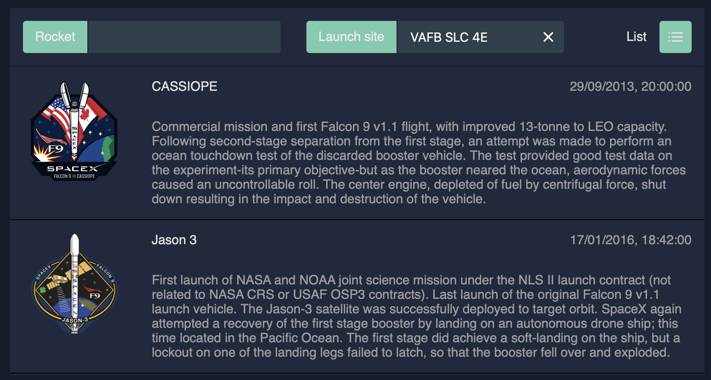

# Verification H

Verification For Corporation-H

 

### Deployment

### How to make it work?

* ▶️ npm install
* ▶️ npm run watch
* ▶️ npm run launch
* 🪤 http://localhost:5000

### Disclaimers by conditions:

* Don't use libraries? - Goes beyond my requirements for completing the assignment. Invented wheels are still enough 🚲
* Will using TypeScript be a plus? - For me, TypeScript is a moody past. Now plain JS love with FP intentions & TS type
  declarations.

### Extensions & the key points:

* 
  React, hmm...
* 
  GraphQL - Simple slice of the model
* 
  Atomic SASS by mixins & initial color theming
* UI environment & basic design - Parallel implementations of UI elements, interactions, and design
* Reusable and extensible components, elements, interactions
* 🚲 Custom state management for UI elements
* 🚲 Custom state management for case components

### Problems & following objectives:

* Comments
* Mobile adaptations
* Tests
* Light theme & theme changing
* Table interactions (sort, resizing)
* Dashboard sidebar
* Dashboard plates customization
* Advanced server-side (auth, personal settings, users interaction)
* Come to UI theme feeling

### Basic preview:

